  <h1>🔍 VISTA</h1>
  
<strong>视觉智能辅助系统（面向视障群体）</strong>

  
  
  
  
  
  
  
  [English](README.md) | [中文](README_zh.md)
  
  

## 🌟 项目愿景

VISTA致力于通过前沿AI技术革新视障群体(BLV)与环境的交互方式。超越传统辅助工具的范畴，VISTA旨在成为一个全方位的多模态AI伴侣，全面提升用户的感知、认知和交互能力。

## 🎯 核心挑战与解决方案

| 挑战 | 解决方案 |
|---------|------------|
| 🚶‍♂️ **导航与移动** | 先进的传感器融合技术(毫米波雷达 + LiDAR)，全天候感知 |
| 👥 **社交互动** | 实时社交线索解读和非视觉反馈 |
| 📱 **数字无障碍** | 跨设备平台的无缝多模态交互 |
| 🏥 **医疗健康** | 智能医疗辅助和健康监测 |

## 🏗️ 系统架构

``` mermaid
graph TD
    A[感知层] --> B[推理层]
    B --> C[交互层]
    C --> D[执行层]
    
    A --> |传感器数据| E[事件总线]
    B --> |决策| E
    C --> |用户输入| E
    D --> |状态| E
```

### 核心组件

1. **感知系统**
   - 多传感器融合
   - 环境建图
   - 实时目标追踪
   - 空间音频处理

2. **推理引擎**
   - 场景理解 (GPT-4V)
   - 风险评估
   - 路径规划
   - 上下文感知

3. **交互界面**
   - 自然语言处理
   - 触觉反馈系统
   - 3D音频导航
   - 手势识别

## 🛠️ 技术栈

<table>
  <tr>
    <th>层级</th>
    <th>技术</th>
    <th>特性</th>
  </tr>
  <tr>
    <td>前端</td>
    <td>
      
    </td>
    <td>
      - 跨平台支持 
      - 无障碍UI/UX 
      - 实时处理能力
    </td>
  </tr>
  <tr>
    <td>后端</td>
    <td>
      
    </td>
    <td>
      - 高性能API 
      - 异步处理 
      - 可扩展架构
    </td>
  </tr>
  <tr>
    <td>AI服务</td>
    <td>
      
    </td>
    <td>
      - 场景理解 
      - 多模态融合 
      - 上下文感知
    </td>
  </tr>
</table>

## 📦 相关仓库

### 核心组件
- 📱 [Vista-frontend](https://github.com/shaowenfu/Vista-frontend) - Flutter移动应用
- 🖥️ [Vista-backend](https://github.com/shaowenfu/Vista_backend) - FastAPI后端服务

## 🗺️ 开发路线图

### 第一阶段：云端MVP
- 基础场景理解
- 文字识别与朗读
- 语音交互界面

### 第二阶段：边缘计算迁移
- 本地AI推理
- 降低延迟（约20ms）
- 增强隐私保护

### 第三阶段：可穿戴设备整合
- 智能眼镜集成
- 触觉反馈系统
- 网状网络支持

## 🔬 研究领域

- **传感器融合**：结合多种传感器输入实现稳健的环境感知
- **隐私计算**：联邦学习与差分隐私保护
- **多模态AI**：跨模态学习与理解
- **边缘智能**：分布式AI处理与优化

## 🤝 贡献指南

我们欢迎开发者、研究人员和领域专家的贡献！提交PR前请阅读[贡献指南](CONTRIBUTING.md)。

## 📄 开源协议

本项目采用MIT协议 - 详见[LICENSE](LICENSE)文件。

## 📚 文档

- [架构设计](docs/architecture.md)
- [需求分析](docs/requirements.md)
- [API文档](https://github.com/shaowenfu/Vista_backend/docs/api.md)

## 🌐 社区

- [讨论区](https://github.com/yourusername/VISTA/discussions)
- [问题追踪](https://github.com/yourusername/VISTA/issues)
- [项目Wiki](https://github.com/yourusername/VISTA/wiki)